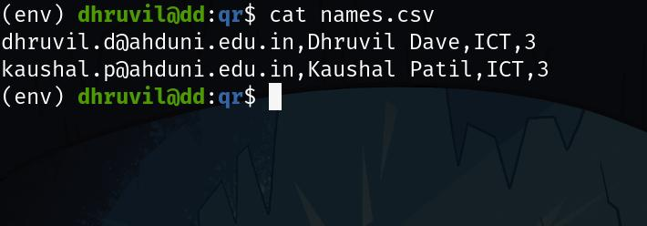

# Automatic-QR-email

This is a program that automates sending emails by generating QR code
by reading data from csv files passed in command line arguments file.

The file should contain the recipient's email-id as the
first detail in the CSV file.

```bash
python3 main.py -f file.csv
```

Sample input:



Sample output:


*The password for the email-id should be the app password provided by Google in App Passwords option of Google Account Settings*
